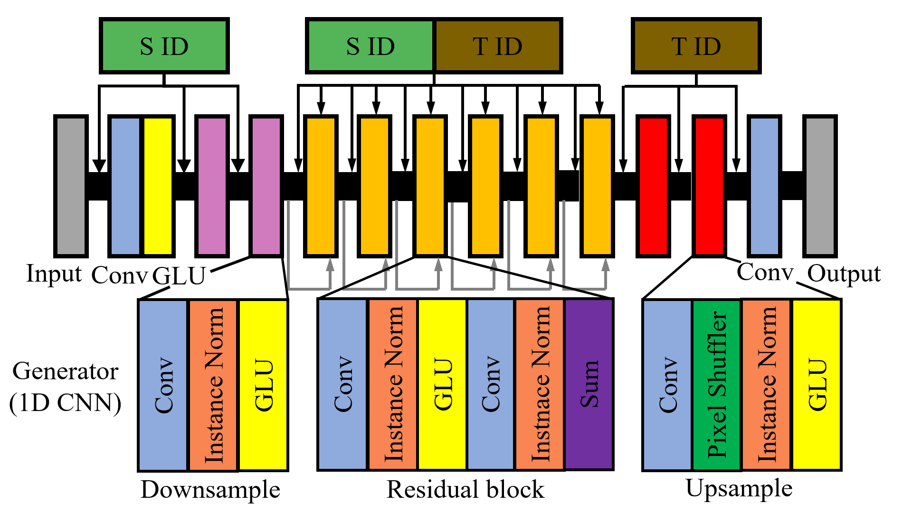
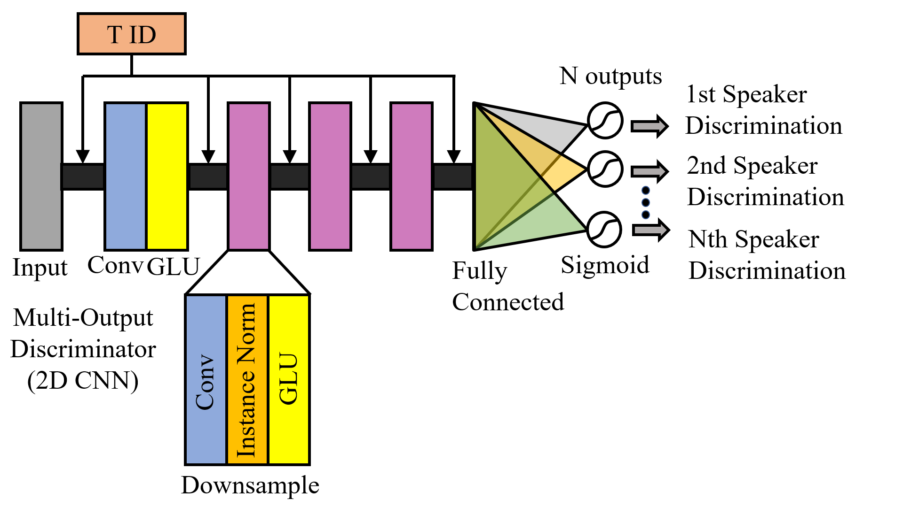

# CCGAN-VC

Shindong Lee  

Korea University

## Overview

Conditional CycleGAN Voice Converter which conducts non-parallel many-to-many voice conversion with single generator and discriminator

**CycleGAN-VC** was successful in non-parallel voice conversion for 2 speakers. CycleGAN-VC needs **2 generators and 2 discriminators** for **one-to-one** voice conversion.

**Conditional CycleGAN-VC (CCGAN-VC)** utilizes speaker identity vectors for additional information and conditions generator and discriminator with them. CCGAN-VC needs **only 1 generator and 1 discriminator** for conducting **many-to-many** voice conversion.

This code was modified from Lei Mao's CycleGAN-VC implementation(https://github.com/leimao/Voice_Converter_CycleGAN).  

<p align="center">
 
</p>

## Performance

#### Voice Quality
Sample voices are uploaded in 'sample' directory.

#### Model Size
|                       | 1 CycleGAN-VC |  50 CycleGAN-VCs  | 1 CCGAN-VC     |
| :---                  |     :---:     |     :---:         |     :---:      |
| Number of speakers    |        2      |       10          |       10       |
| Converting Directions |        2      |       100         |       100      |
| Number of G and D     |        2      |       100         |     **1**      |
| Training Time         |     0.7 days  |       34.6 days   |   **3.9 days** |
| Model Size            |     1.35GB    |       67.50GB     |   **0.69GB**   |

## Reference

#### CycleGAN-VC 
"Parallel-Data-Free Voice Conversion Using Cycle-Consistent Adversarial Networks" by Takuhiro Kaneko and Hirokazu Kameoka
(paper: https://arxiv.org/abs/1711.11293)  
(demo: http://www.kecl.ntt.co.jp/people/kaneko.takuhiro/projects/cyclegan-vc/)  
(V2: http://www.kecl.ntt.co.jp/people/kaneko.takuhiro/projects/cyclegan-vc2/index.html)  
(Tensorflow implementation by Lei Mao: https://github.com/leimao/Voice_Converter_CycleGAN)   

#### Dataset 
VCC2016 Dataset: (It's already inside the repo)  
(http://vc-challenge.org/vcc2016/summary.html)  


## How to Run

### Train
```bash
$ python train.py --speaker_name_list [speaker_name_list] --num_epochs [num_epochs] --train_dir [train_dir] --model_dir [model_dir] --model_name [model_name] --random_seed [random_seed] --validation_dir [validation_dir] --output_dir [output_dir] --tensorboard_log_dir [tensorboard_log_dir]
```
ex)
```bash
$ python train.py --speaker_name_list SF1 SF2 SF3 SM1 SM2 TF1 TF2 TM1 TM2 TM3 --num_epochs 251 --train_dir ./data/vcc2016_training/ --model_dir ./model --model_name CCGAN.ckpt --random_seed 0 --validation_dir ./data/evaluation_all/ --output_dir ./validation_output --tensorboard_log_dir ./log
```
All arguments are optional. (You can omit any argument)

ex)

```bash
$ python train.py --speaker_name_list SF1 SF2 SF3 SM1 SM2 TF1 TF2 TM1 TM2 TM3 --num_epochs 251
```

or

```bash
$ python train.py --speaker_name_list SF1 SF2 SF3 SM1 SM2 --num_epochs 501
```

or simply,

```bash
$ python train.py
```

It conducts validiton during training every 100 epochs for first speaker and last speaker of speaker name list.

### Test
#### For 1 X 1 voice conversion (1 direction)

```bash
$ python convert.py --speaker_name_list [speaker_name_list] --src [src] --tar [tar] --model_dir [model_dir] --model_name [model_name] --data_dir [data_dir] --output_dir [output_dir]
```

ex)

```bash
$ python convert.py --speaker_name_list SF1 SF2 SF3 SM1 SM2 TF1 TF2 TM1 TM2 TM3 --src SF1 --tar TM3 model_dir ./model --model_name CCGAN.ckpt --data_dir ./data/evaluation_all/ --output_dir ./converted_voices/
```

or simply,

```bash
$ python convert.py --speaker_name_list SF1 SF2 SF3 SM1 SM2 TF1 TF2 TM1 TM2 TM3 --src SF1 --tar TM3
```

You must put all speakers' names into speaker_name_list in the order that you set in training, since it creates one-hot vector with the list.

#### For n X n voice conversion (n^2 direction)

```bash
$ python convert_all.py --speaker_name_list [speaker_name_list] --model_dir [model_dir] --model_name [model_name] --data_dir [data_dir] --output_dir [output_dir]
```

ex)

```bash
$ python convert_all.py --speaker_name_list SF1 SF2 SF3 SM1 SM2 TF1 TF2 TM1 TM2 TM3 model_dir ./model --model_name CCGAN.ckpt --data_dir ./data/evaluation_all/ --output_dir ./converted_voices/
```

or simply,

```bash
$ python convert_all.py --speaker_name_list SF1 SF2 SF3 SM1 SM2 TF1 TF2 TM1 TM2 TM3
```

or ex)

```bash
$ python convert_all.py --speaker_name_list SF1 SF2 SM1 TF1 TM1 TM3
```

You must put all speakers' names into speaker_name_list in the order that you set in training, since it creates one-hot vector with the list.

#### For n X n voice conversion (n^2 direction) with only selected sentences

```bash
$ python convert_all_sample.py --speaker_name_list [speaker_name_list] --wav_list [wav_list] --model_dir [model_dir] --model_name [model_name] --data_dir [data_dir] --output_dir [output_dir]
```

ex)

```bash
$ python convert_all_sample.py --speaker_name_list SF1 SF2 SF3 SM1 SM2 TF1 TF2 TM1 TM2 TM3 --wav_list 200001.wav 200002.wav 200003.wav model_dir ./model --model_name CCGAN.ckpt --data_dir ./data/evaluation_all/ --output_dir ./converted_voices/
```

or simply,

```bash
$ python convert_all_sample.py --speaker_name_list SF1 SF2 SF3 SM1 SM2 TF1 TF2 TM1 TM2 TM3
```

or ex)

```bash
$ python convert_all_sample.py --speaker_name_list SF1 SF2 SM1 TF1 TM1 TM3
```

You must put all speakers' names into speaker_name_list in the order that you set in training, since it creates one-hot vectors with the list.

### Data Download
(Since data are already in this repo, this is only for when you lost them)

```bash
$ python download.py
```

### For debugging

```bash
$ python weight.py
```

It prints max and min of weights connected to one-hot vectors.

